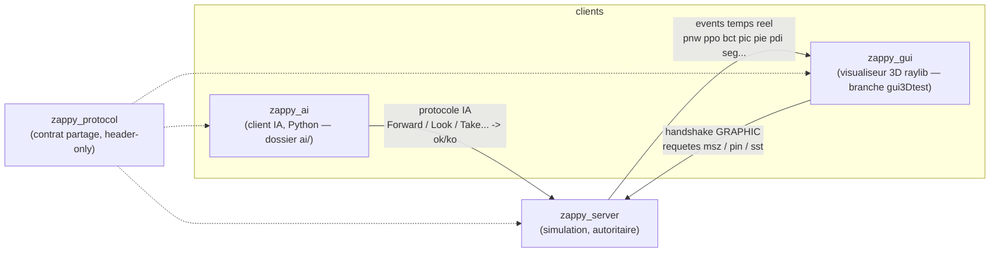
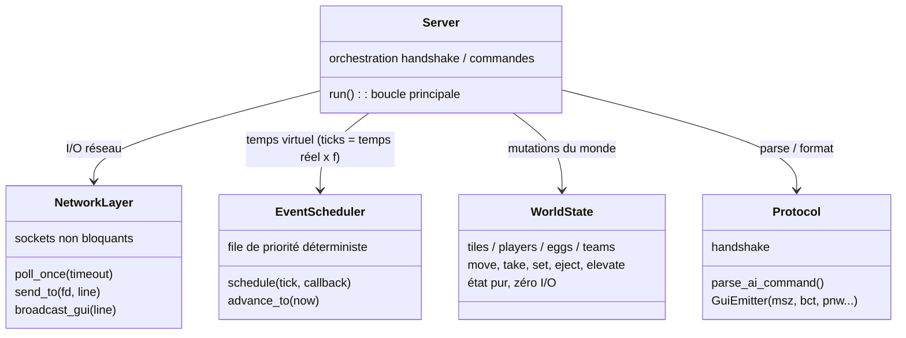
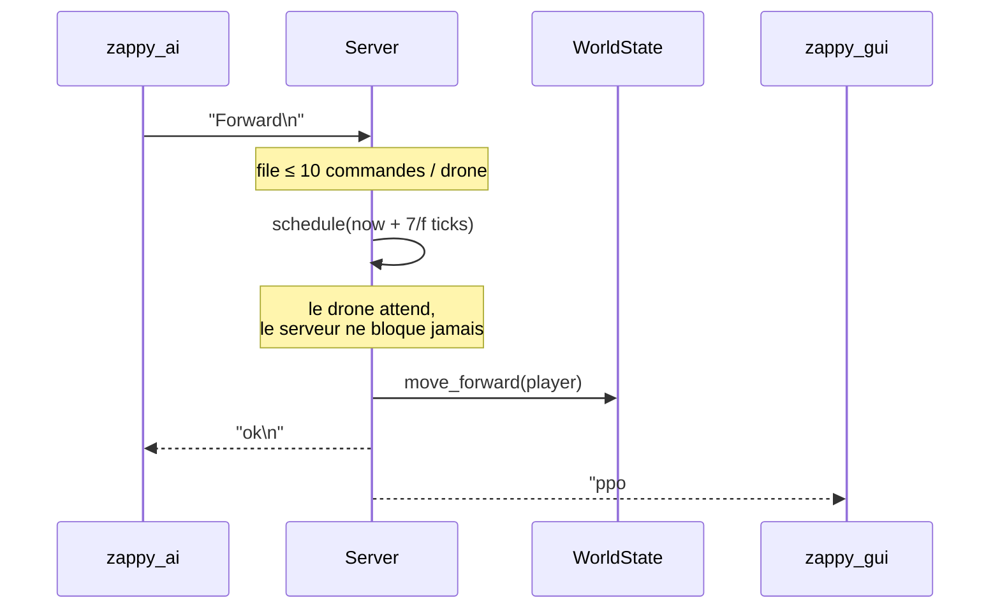
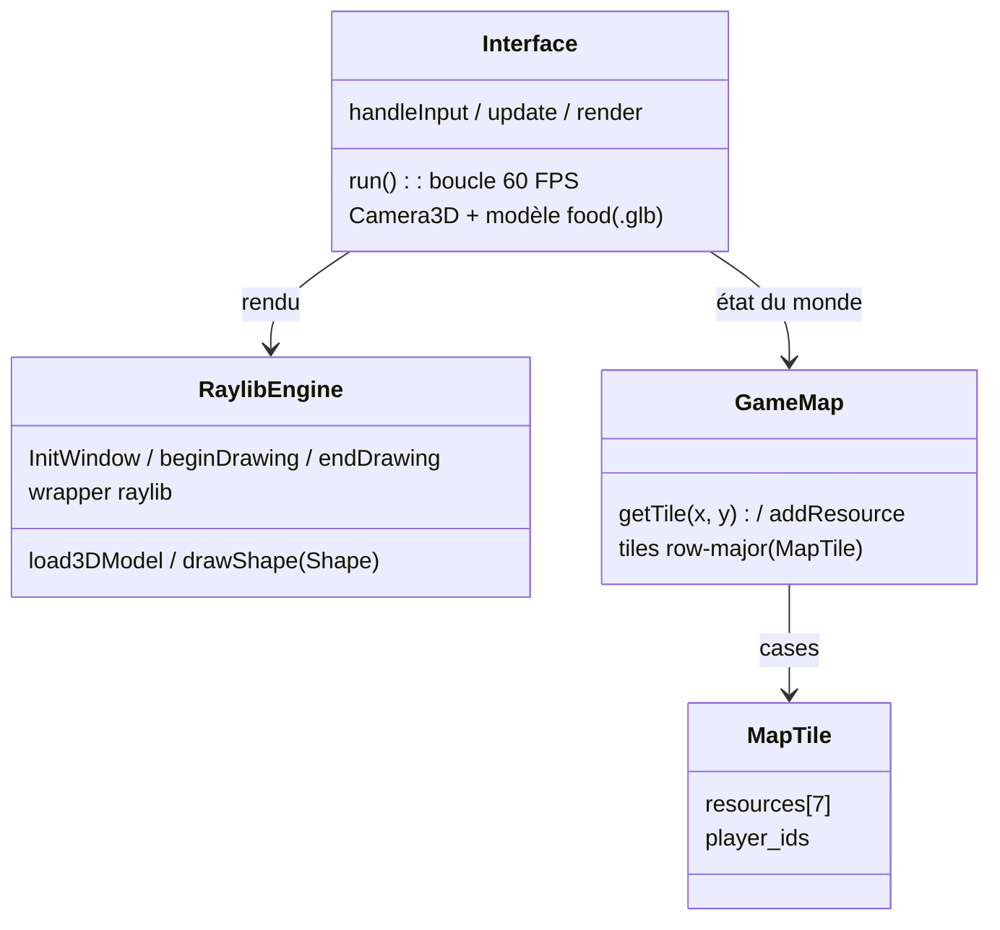

# 08 — UML overview (vue d'ensemble)

Diagrammes volontairement simples — les grandes idées seulement.
Rendu automatique sur GitHub et sur le site MkDocs (plugin mermaid2).

## 1. Composants

Une seule source de vérité : le serveur. Les GUIs sont des miroirs passifs
(événements poussés), les IA n'ont que leur vision locale (`Look`).

## 2. Serveur — classes principales

Mono-thread, événementiel : tout (coût des actions, faim, incantations,
respawn) est un callback planifié à un tick. `poll()` dort jusqu'au prochain
paquet **ou** prochain événement.

## 3. Cycle de vie d'une commande IA

## 4. GUI 3D (branche `gui3Dtest`, dossier `gui3d/`)

Le GUI est développé séparément (sur `main`, `gui/` n'est qu'un placeholder).
La version active est **`gui3d/`** sur la branche `gui3Dtest` : un rendu 3D
raylib (caméra `Camera3D`, modèles `.glb` par ressource). Le rendu et la carte
existent ; le branchement réseau (handshake `GRAPHIC` + parse du protocole GUI)
reste à câbler — `main.cpp` peuple aujourd'hui la carte avec des ressources de
test.

Le serveur reste l'unique source de vérité : à terme le GUI ne fera que
refléter les événements poussés (cf. section 1), via le même contrat de
protocole côté serveur, indépendamment de l'implémentation du rendu.

## 5. Règles clefs (rappel)

| Mécanisme | Valeur |
|---|---|
| Vie | 1 food = 126/f secondes, famine → mort (`pdi`) |
| Incantation | gel des participants, 300 ticks, re-vérification à la fin |
| Respawn ressources | toutes les 20 ticks, complément vers densités cibles |
| Victoire | 6 joueurs niveau 8 dans une équipe → `seg` |
