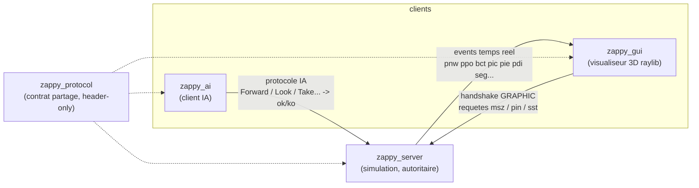
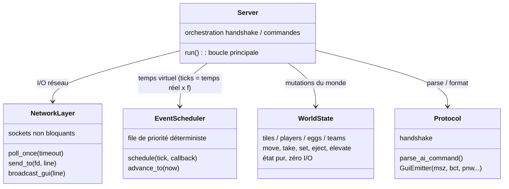
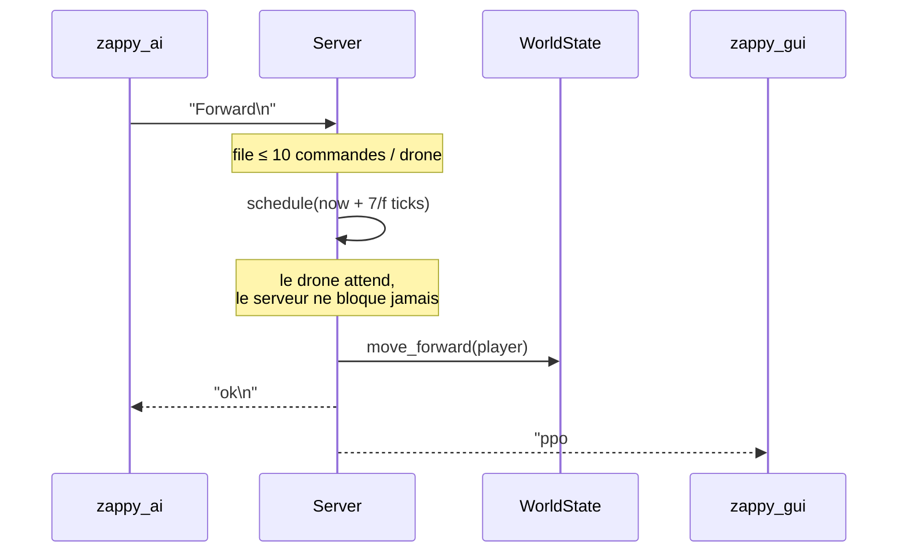
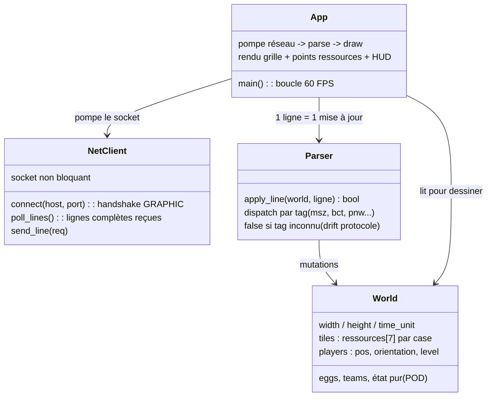

# 08 — UML overview (vue d'ensemble)

Diagrammes volontairement simples — les grandes idées seulement.
Rendu automatique sur GitHub et sur le site MkDocs (plugin mermaid2).

## 1. Composants

Une seule source de vérité : le serveur. Les GUIs sont des miroirs passifs
(événements poussés), les IA n'ont que leur vision locale (`Look`).

## 2. Serveur — classes principales

Mono-thread, événementiel : tout (coût des actions, faim, incantations,
respawn) est un callback planifié à un tick. `poll()` dort jusqu'au prochain
paquet **ou** prochain événement.

## 3. Cycle de vie d'une commande IA

## 4. GUI sur la branche `main` — `zappy_gui2d`

Sur `main`, le visualiseur fonctionnel est **`zappy_gui2d`** (raylib, 2D) :
un outil de debug volontairement minimal pour *voir* l'état du serveur en
direct. (`zappy_gui` y est encore un stub ; le visualiseur 3D complet —
planète torus, HUD, post-FX — vit sur la branche `feat/raylib-3d-gui`.)

Pipeline en 4 étapes : pomper le socket, parser chaque ligne,
mettre à jour un état POD, le dessiner à 60 FPS. C'est ce même pipeline
(net → parse → état → rendu) que la version 3D réutilise et étend.

## 5. Règles clefs (rappel)

| Mécanisme | Valeur |
|---|---|
| Vie | 1 food = 126/f secondes, famine → mort (`pdi`) |
| Incantation | gel des participants, 300 ticks, re-vérification à la fin |
| Respawn ressources | toutes les 20 ticks, complément vers densités cibles |
| Victoire | 6 joueurs niveau 8 dans une équipe → `seg` |
