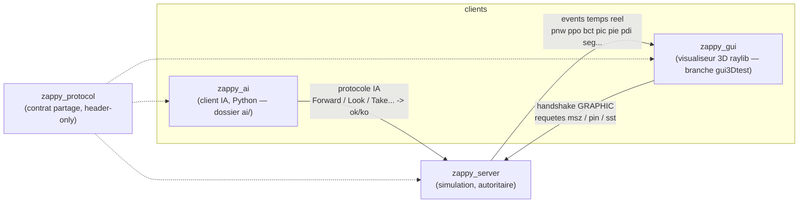
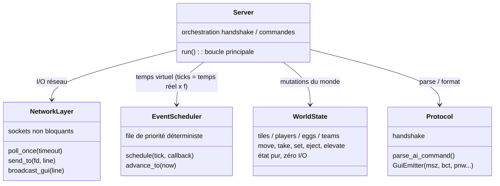
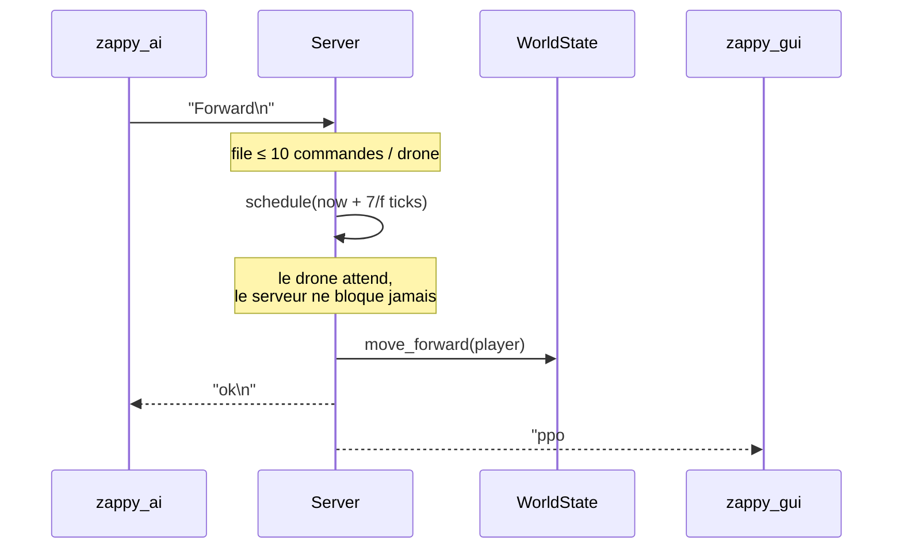
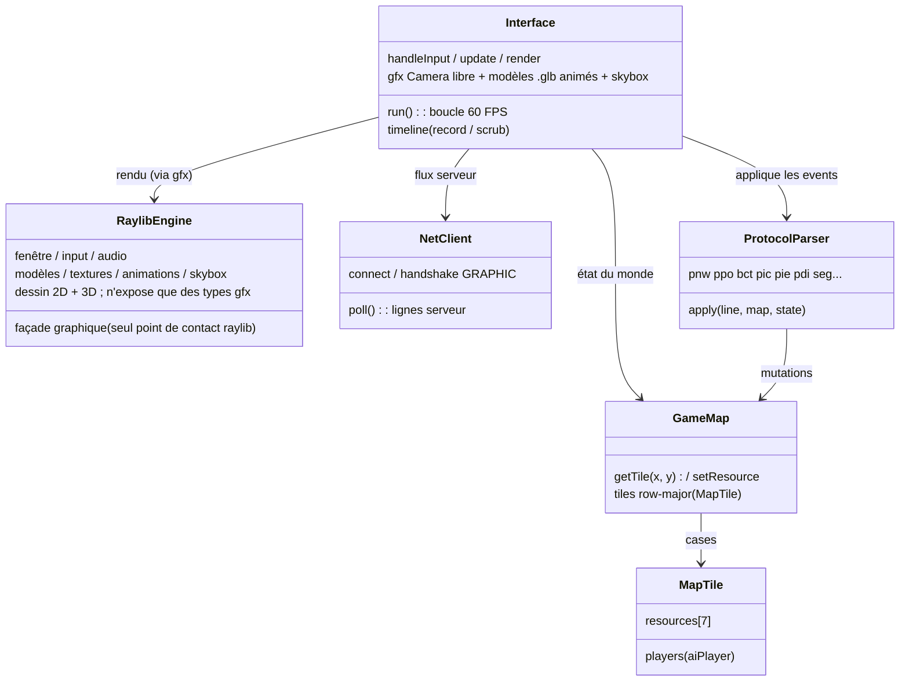
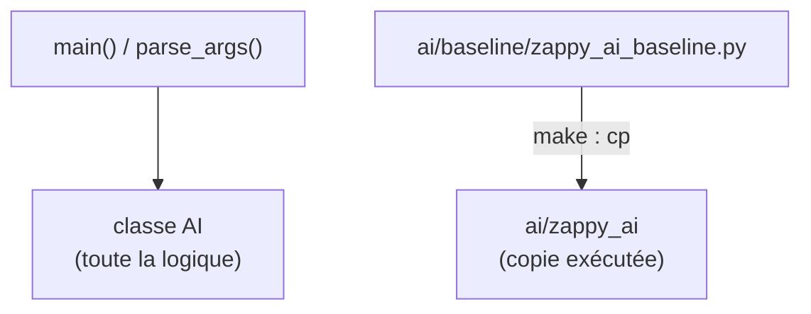
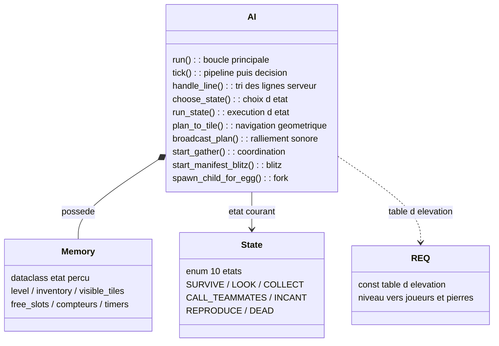

# UML overview (vue d'ensemble)

Diagrammes volontairement simples — les grandes idées seulement.
Rendu automatique sur GitHub et sur le site MkDocs (plugin mermaid2).

## 1. Composants

Une seule source de vérité : le serveur. Les GUIs sont des miroirs passifs
(événements poussés), les IA n'ont que leur vision locale (`Look`).

## 2. Serveur — classes principales

Mono-thread, événementiel : tout (coût des actions, faim, incantations,
respawn) est un callback planifié à un tick. `poll()` dort jusqu'au prochain
paquet **ou** prochain événement.

## 3. Cycle de vie d'une commande IA

## 4. GUI 3D (branche `gui3Dtest`, dossier `gui3d/`)

La version active est **`gui3d/`** sur la branche `gui3Dtest` : un rendu 3D
raylib (caméra libre, modèles `.glb` par ressource + drone animé, skybox 360,
audio). Le réseau **est câblé** : `main.cpp` se connecte, fait le handshake
`GRAPHIC` (`msz`/dimensions), puis `Interface` lit le flux via `NetClient` et
applique chaque événement poussé (`pnw ppo bct pic pie pdi seg…`) au monde via
`ProtocolParser`. Une timeline enregistre tout (record + scrub + pause).

raylib est **entièrement encapsulé** : seule `RaylibEngine` (TU
`raylibWrapper.cpp`) touche raylib ; tout le reste ne manipule que des types
neutres `gfx::` (Vec3, Color, Camera, handles opaques) — `interface.cpp` ne
contient aucun symbole raylib.

Le serveur reste l'unique source de vérité : le GUI ne fait que refléter les
événements poussés (cf. section 1), via le même contrat de protocole, quelle
que soit l'implémentation du rendu.

## 5. Règles clefs (rappel)

| Mécanisme | Valeur |
|---|---|
| Vie | 1 food = 126/f secondes, famine → mort (`pdi`) |
| Incantation | gel des participants, 300 ticks, re-vérification à la fin |
| Respawn ressources | toutes les 20 ticks, complément vers densités cibles |
| Victoire | 6 joueurs niveau 8 dans une équipe → `seg` |

## 6. Client IA (dossier `ai/`) — structure du code

Un seul module fait tout le bot : [`ai/baseline/zappy_ai_baseline.py`]. `make`
le **copie** en `ai/zappy_ai` (l'exécutable lancé). Comportement/stratégie
détaillés dans [`ai/AI_OVERVIEW.md`](../../ai/AI_OVERVIEW.md).

Le cœur est la classe **`AI`** : un automate qui possède un `Memory` (l'état du
monde perçu) et un `State` courant. Une seule socket non bloquante, un pipeline
FIFO de commandes (`pending`, ≤ 8). Les méthodes se regroupent par
responsabilité.

Boucle de contrôle : `run()` (`select` sur la socket) → `handle_line()` classe
chaque ligne serveur (réponse `ok/ko`, `Current level`, broadcast, `dead`…) →
`tick()` vide le pipeline puis appelle `choose_state()` / `run_state()`. La
navigation est purement géométrique (`Look` → indices de tuiles → plan
`Left/Right/Forward`), le ralliement purement sonore (`broadcast_plan` sur le cap
`K`). Le serveur reste l'unique source de vérité : l'IA n'a que sa vision locale
et l'audio des broadcasts.
